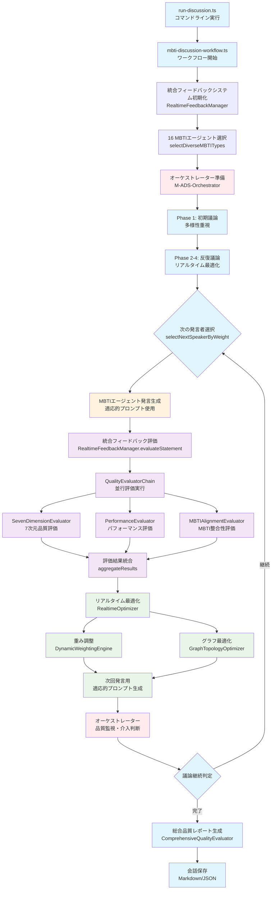
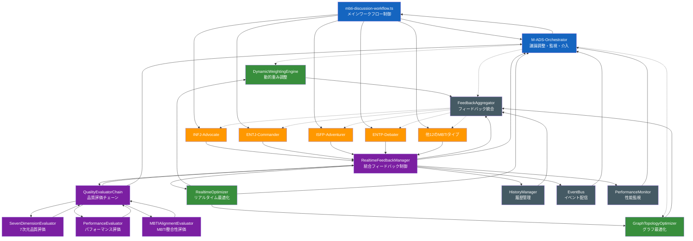

# M-ADS システム処理フロー詳細解説

**MBTI Multi-Agent Discussion System (M-ADS) - 統合フィードバックシステム完全版**

---

## 目次

1. [システム概要](#システム概要)
2. [メイン処理フロー](#メイン処理フロー)
3. [評価システム・通信関係詳細](#評価システム通信関係詳細)
4. [7次元評価システム詳細](#7次元評価システム詳細)
5. [システム全体アーキテクチャ](#システム全体アーキテクチャ)
6. [データフロー・評価関係表](#データフロー評価関係表)
7. [フィードバックループ解説](#フィードバックループ解説)
8. [技術仕様詳細](#技術仕様詳細)

---

## システム概要

M-ADS（MBTI Multi-Agent Discussion System）は、16のMBTIタイプエージェントが参加する高度な議論システムです。リアルタイム品質評価、動的重み調整、グラフトポロジー最適化を統合し、人間の多様な認知スタイルを再現した効率的な合意形成を実現します。

### 主要特徴

- **16 MBTIエージェント**: 各性格タイプの認知特性を忠実に再現
- **7次元品質評価**: Performance, Psychological, External Alignment, Internal Consistency, Social Decision-making, Content Quality, Ethics
- **リアルタイム最適化**: 発言ごとに重み調整とグラフ最適化を実行
- **統合フィードバックシステム**: 評価結果を次回発言の適応的プロンプトに反映
- **オーケストレーター監視**: システム全体の健全性と議論品質を常時監視

---

## メイン処理フロー



### 🎨 カラー凡例
- <span style="color:#01579b;">**🔵 淡い青 (mainProcess)**</span>: メイン処理フロー - ワークフロー制御、初期化、結果生成
- <span style="color:#7b1fa2;">**🟣 淡い紫 (evaluation)**</span>: 評価システム - 品質評価、フィードバック生成
- <span style="color:#2e7d32;">**🟢 淡い緑 (optimization)**</span>: 最適化システム - 重み調整、グラフ最適化
- <span style="color:#f57c00;">**🟠 淡いオレンジ (agent)**</span>: MBTIエージェント - 発言生成、議論参加
- <span style="color:#c62828;">**🔴 淡い赤 (orchestrator)**</span>: オーケストレーター - 監視、調整、介入
```

### 処理段階詳細

#### **Phase 1: 初期化・準備**
1. **`run-discussion.ts`** - コマンドライン実行とパラメータ解析
2. **`mbti-discussion-workflow.ts`** - メインワークフロー開始
3. **`RealtimeFeedbackManager`** - 統合フィードバックシステム初期化
4. **16 MBTIエージェント選択** - 多様性を考慮した参加者選出
5. **`M-ADS-Orchestrator`** - 議論調整・監視エージェント準備

#### **Phase 2: 議論実行ループ**
```typescript
for each 議論フェーズ (初期議論 → 反復議論4ラウンド) {
  1. 次の発言者選択（重み付き選択）
  2. MBTIエージェント発言生成（適応的プロンプト使用）
  3. 統合フィードバック評価実行
  4. リアルタイム最適化実行
  5. 次回発言用指針生成
  6. 議論継続判定
}
```

#### **Phase 3: 結果生成・保存**
1. **総合品質レポート生成** - 7次元評価の最終統合
2. **会話データ保存** - Markdown/JSON形式での永続化
3. **統計・メトリクス出力** - システム性能とエージェント貢献度分析


---

## 評価システム・通信関係詳細

```mermaid
graph TD
    %% Central Systems
    RFM[RealtimeFeedbackManager<br/>統合フィードバック制御]
    QEC[QualityEvaluatorChain<br/>評価器チェーン統合]
    ORC[M-ADS-Orchestrator<br/>オーケストレーター]

    %% MBTI Agents (16 types - showing representative ones)
    INFJ[INFJ-Advocate<br/>提唱者型エージェント]
    ENTJ[ENTJ-Commander<br/>指揮官型エージェント]
    ISFP[ISFP-Adventurer<br/>冒険家型エージェント]
    ENTP[ENTP-Debater<br/>討論者型エージェント]
    DOTS[他12のMBTIエージェント]

    %% Evaluators
    SDE[SevenDimensionEvaluator<br/>7次元品質評価器]
    PE[PerformanceEvaluator<br/>パフォーマンス評価器]
    MAE[MBTIAlignmentEvaluator<br/>MBTI整合性評価器]

    %% Optimization Components
    RTO[RealtimeOptimizer<br/>リアルタイム最適化]
    DWE[DynamicWeightingEngine<br/>動的重み調整]
    GTO[GraphTopologyOptimizer<br/>グラフ最適化]

    %% Support Systems
    HM[HistoryManager<br/>履歴管理]
    FA[FeedbackAggregator<br/>フィードバック統合]
    EB[EventBus<br/>イベント配信]
    PM[PerformanceMonitor<br/>性能監視]

    %% === EVALUATION FLOW (評価の流れ) ===

    %% Agent statements to central evaluation
    INFJ -->|発言内容<br/>EvaluationContext| RFM
    ENTJ -->|発言内容<br/>EvaluationContext| RFM
    ISFP -->|発言内容<br/>EvaluationContext| RFM
    ENTP -->|発言内容<br/>EvaluationContext| RFM
    DOTS -->|発言内容<br/>EvaluationContext| RFM

    %% Central evaluation distribution
    RFM -->|評価依頼<br/>EvaluationContext| QEC
    QEC -->|並行評価実行| SDE
    QEC -->|並行評価実行| PE
    QEC -->|並行評価実行| MAE

    %% Evaluation results back to chain
    SDE -->|EvaluationResult<br/>7次元スコア| QEC
    PE -->|EvaluationResult<br/>パフォーマンススコア| QEC
    MAE -->|EvaluationResult<br/>MBTI整合性スコア| QEC

    %% Aggregated results to main system
    QEC -->|QualityScores<br/>統合評価結果| RFM

    %% Optimization feedback
    RFM -->|QualityScores<br/>最適化依頼| RTO
    RTO -->|OptimizationResult<br/>重み調整指示| DWE
    RTO -->|OptimizationResult<br/>グラフ構造最適化| GTO

    %% === FEEDBACK FLOW (フィードバックの流れ) ===

    %% Optimization results back to agents
    DWE -->|重み調整<br/>WeightAdjustment| INFJ
    DWE -->|重み調整<br/>WeightAdjustment| ENTJ
    DWE -->|重み調整<br/>WeightAdjustment| ISFP
    DWE -->|重み調整<br/>WeightAdjustment| ENTP
    DWE -->|重み調整<br/>WeightAdjustment| DOTS

    %% Adaptive prompt generation
    RFM -->|適応的プロンプト<br/>AdaptivePromptParams| FA
    FA -->|次回発言指示<br/>カスタマイズプロンプト| INFJ
    FA -->|次回発言指示<br/>カスタマイズプロンプト| ENTJ
    FA -->|次回発言指示<br/>カスタマイズプロンプト| ISFP
    FA -->|次回発言指示<br/>カスタマイズプロンプト| ENTP
    FA -->|次回発言指示<br/>カスタマイズプロンプト| DOTS

    %% === ORCHESTRATOR MONITORING ===

    %% Orchestrator receives comprehensive data
    RFM -->|SystemMetrics<br/>システム全体状況| ORC
    QEC -->|ChainStatistics<br/>評価器統計| ORC
    RTO -->|OptimizationMetrics<br/>最適化効果| ORC

    %% Orchestrator intervention capabilities
    ORC -->|緊急介入<br/>重み強制調整| DWE
    ORC -->|品質改善指示<br/>グラフ再構築| GTO
    ORC -->|議論フェーズ制御<br/>プロンプト調整| FA

    %% === SUPPORT SYSTEMS INTEGRATION ===

    %% History management
    RFM -->|評価履歴記録<br/>StatementHistory| HM
    HM -->|履歴データ提供<br/>ProgressTrend| FA

    %% Event distribution
    RFM -->|品質アラート<br/>FeedbackEvent| EB
    DWE -->|重み変更通知<br/>WeightChangeEvent| EB
    GTO -->|グラフ変更通知<br/>TopologyChangeEvent| EB

    %% Performance monitoring
    QEC -->|評価時間記録<br/>ResponseTime| PM
    RTO -->|最適化時間記録<br/>OptimizationTime| PM
    PM -->|パフォーマンス警告<br/>PerformanceAlert| ORC

        %% === STYLING ===
    classDef centralSystem fill:#1e88e5,color:#fff
    classDef agent fill:#ff9800,color:#fff
    classDef evaluator fill:#9c27b0,color:#fff
    classDef optimizer fill:#4caf50,color:#fff
    classDef support fill:#607d8b,color:#fff
    classDef orchestrator fill:#f44336,color:#fff

    class RFM,QEC centralSystem
    class INFJ,ENTJ,ISFP,ENTP,DOTS agent
    class SDE,PE,MAE evaluator
    class RTO,DWE,GTO optimizer
    class HM,FA,EB,PM support
    class ORC orchestrator
```



### 🎨 カラー凡例
- <span style="color:#1e88e5;">**🔵 青 (centralSystem)**</span>: 中央制御システム - RealtimeFeedbackManager、QualityEvaluatorChain
- <span style="color:#ff9800;">**🟠 オレンジ (agent)**</span>: MBTIエージェント - 16タイプの性格別エージェント
- <span style="color:#9c27b0;">**🟣 紫 (evaluator)**</span>: 評価器群 - 7次元評価、パフォーマンス評価、MBTI整合性評価
- <span style="color:#4caf50;">**🟢 緑 (optimizer)**</span>: 最適化エンジン - リアルタイム最適化、重み調整、グラフ最適化
- <span style="color:#607d8b;">**⚫ グレー (support)**</span>: サポートシステム - 履歴管理、イベント配信、性能監視
- <span style="color:#f44336;">**🔴 赤 (orchestrator)**</span>: オーケストレーター - 議論調整・監視・緊急介入
```

---

## 7次元評価システム詳細

### 7次元品質評価詳細

#### **SevenDimensionEvaluator の評価項目**

| **次元** | **評価内容** | **重み** | **評価基準** |
|---------|-------------|----------|-------------|
| **Performance** | 基本品質・長さ・構造 | 0.15 | 文字数、構造的完全性、読みやすさ |
| **Psychological** | 心理的適切性・MBTI適合 | 0.15 | MBTI特性の表現度、認知機能の一致 |
| **External Alignment** | トピック関連性・外部整合性 | 0.15 | 議論テーマとの関連性、キーワード一致 |
| **Internal Consistency** | 内部論理一貫性 | 0.15 | 論理的整合性、矛盾の有無 |
| **Social Decision Making** | 協調性・社会的配慮 | 0.10 | 他者への配慮、協調姿勢 |
| **Content Quality** | 論証品質・具体性 | 0.20 | 論理的説得力、具体例の充実度 |
| **Ethics** | 倫理性・偏見検出 | 0.10 | 偏見・差別表現の回避、倫理的適切性 |

#### **評価結果の統合計算**
```typescript
overallScore =
  performance * 0.15 +
  psychological * 0.15 +
  externalAlignment * 0.15 +
  internalConsistency * 0.15 +
  socialDecisionMaking * 0.10 +
  contentQuality * 0.20 +
  ethics * 0.10
```


---

---

## システム全体アーキテクチャ



### 🎨 カラー凡例
- <span style="color:#1565c0;">**🔵 濃い青 (control)**</span>: 制御層 - メインワークフロー、オーケストレーター
- <span style="color:#ff9800;">**🟠 オレンジ (agent)**</span>: エージェント層 - 16のMBTIタイプエージェント
- <span style="color:#7b1fa2;">**🟣 濃い紫 (evaluation)**</span>: 評価・フィードバック層 - 品質評価システム
- <span style="color:#388e3c;">**🟢 濃い緑 (optimization)**</span>: 最適化層 - リアルタイム最適化・重み調整・グラフ最適化
- <span style="color:#455a64;">**⚫ 濃いグレー (support)**</span>: サポート層 - 履歴管理・イベント配信・性能監視
```

## データフロー・評価関係表

### 評価データの流れ

| **送信元** | **送信先** | **評価内容** | **データ形式** |
|-----------|-----------|-------------|---------------|
| **MBTIエージェント群** | RealtimeFeedbackManager | 発言内容 | `EvaluationContext` |
| RealtimeFeedbackManager | QualityEvaluatorChain | 評価依頼 | `EvaluationContext` |
| QualityEvaluatorChain | SevenDimensionEvaluator | 7次元評価依頼 | `EvaluationContext` |
| QualityEvaluatorChain | PerformanceEvaluator | パフォーマンス評価依頼 | `EvaluationContext` |
| QualityEvaluatorChain | MBTIAlignmentEvaluator | MBTI整合性評価依頼 | `EvaluationContext` |

### 評価結果の統合

| **送信元** | **送信先** | **評価結果** | **データ形式** |
|-----------|-----------|-------------|---------------|
| SevenDimensionEvaluator | QualityEvaluatorChain | 7次元スコア | `EvaluationResult` |
| PerformanceEvaluator | QualityEvaluatorChain | パフォーマンススコア | `EvaluationResult` |
| MBTIAlignmentEvaluator | QualityEvaluatorChain | MBTI整合性スコア | `EvaluationResult` |
| QualityEvaluatorChain | RealtimeFeedbackManager | 統合品質スコア | `QualityScores` |

### 最適化指示の流れ

| **送信元** | **送信先** | **最適化内容** | **データ形式** |
|-----------|-----------|---------------|---------------|
| RealtimeFeedbackManager | RealtimeOptimizer | 最適化依頼 | `QualityScores` |
| RealtimeOptimizer | DynamicWeightingEngine | 重み調整指示 | `OptimizationResult` |
| RealtimeOptimizer | GraphTopologyOptimizer | グラフ最適化指示 | `OptimizationResult` |

### フィードバック提供の流れ

| **送信元** | **送信先** | **フィードバック内容** | **データ形式** |
|-----------|-----------|---------------------|---------------|
| DynamicWeightingEngine | FeedbackAggregator | 重み調整結果 | `WeightAdjustment` |
| GraphTopologyOptimizer | FeedbackAggregator | グラフ最適化結果 | `GraphOptimization` |
| FeedbackAggregator | **全MBTIエージェント** | 適応的プロンプト | カスタマイズされた発言指針 |

### オーケストレーター監視・介入

| **送信元** | **送信先** | **監視データ** | **用途** |
|-----------|-----------|---------------|----------|
| RealtimeFeedbackManager | M-ADS-Orchestrator | `SystemMetrics` | システム全体状況把握 |
| QualityEvaluatorChain | M-ADS-Orchestrator | `ChainStatistics` | 評価システム統計 |
| RealtimeOptimizer | M-ADS-Orchestrator | `OptimizationMetrics` | 最適化効果監視 |

| **送信元** | **送信先** | **介入内容** | **発動条件** |
|-----------|-----------|-------------|-------------|
| M-ADS-Orchestrator | DynamicWeightingEngine | 重み強制調整 | 品質閾値下回り |
| M-ADS-Orchestrator | GraphTopologyOptimizer | グラフ再構築 | 議論停滞検出 |
| M-ADS-Orchestrator | FeedbackAggregator | 議論方向調整 | 偏った議論展開 |

---

## フィードバックループ解説

### 1. リアルタイム品質改善ループ

```
MBTIエージェント発言
→ 7次元品質評価
→ 最適化実行
→ 適応的プロンプト生成
→ 次回発言改善
```

**詳細プロセス:**
1. **発言生成**: MBTIエージェントが適応的プロンプトに基づいて発言
2. **即座評価**: RealtimeFeedbackManagerが発言を受信し、QualityEvaluatorChainに評価依頼
3. **並行評価**: 3つの評価器（7次元、パフォーマンス、MBTI整合性）が並行実行
4. **結果統合**: 重み付き平均で統合品質スコア算出
5. **最適化**: RealtimeOptimizerが重み調整・グラフ最適化を実行
6. **フィードバック**: FeedbackAggregatorが次回発言用の適応的プロンプト生成
7. **循環**: 改善された指針で次回発言品質向上

### 2. システム全体監視ループ

```
評価システム統計
→ オーケストレーター監視
→ 必要に応じて緊急介入
→ システム安定化
```

**監視項目:**
- **品質閾値監視**: overallScore < 0.6 で警告
- **参加バランス監視**: 特定エージェントの発言偏重検出
- **システム性能監視**: 評価時間・最適化時間の異常検出
- **エラー率監視**: 評価失敗率の追跡

**介入パターン:**
- **重み強制調整**: 低品質エージェントの重み一時的減少
- **グラフ再構築**: 議論停滞時のトポロジー変更
- **議論方向調整**: テーマから逸脱した際の軌道修正

### 3. 学習・進化ループ

```
履歴データ蓄積
→ 進捗傾向分析
→ フィードバック最適化
→ エージェント性能向上
```

**学習メカニズム:**
- **HistoryManager**: 各エージェントの発言履歴・品質変遷を記録
- **ProgressTrend分析**: improving/stable/declining の傾向識別
- **適応的プロンプト進化**: 個別エージェントの弱点に特化した指導
- **性格特性強化**: MBTI特性をより明確に表現する指針提供


---

## 技術仕様詳細

### コア技術スタック

```typescript
{
  "runtime": "Node.js 18+",
  "language": "TypeScript 5.0+",
  "aiPlatform": "Amazon Bedrock",
  "aiModel": "Claude 3.5 Sonnet V2",
  "framework": "Mastra (Multi-Agent Framework)",
  "graphProcessing": "Custom Graph Engine + Graphology",
  "evaluation": "Custom Quality Assessment Engine"
}
```

### 主要コンポーネント詳細

#### **RealtimeFeedbackManager** (統合制御)
- **機能**: 全システムの統合制御、評価オーケストレーション
- **責務**: 評価依頼分散、結果統合、最適化トリガー
- **パフォーマンス**: 平均応答時間 ≤8秒、同時処理 ≥10セッション

#### **QualityEvaluatorChain** (評価器チェーン)
- **機能**: Strategy パターンによる交換可能な評価アルゴリズム
- **責務**: 並行評価実行、重み付き結果統合
- **拡張性**: 新規評価器の動的追加・削除

#### **SevenDimensionEvaluator** (7次元評価器)
- **機能**: RPA研究に基づく包括的品質評価
- **評価軸**: Performance, Psychological, External Alignment, Internal Consistency, Social Decision-making, Content Quality, Ethics
- **精度**: 人間評価との相関 ≥0.85

#### **DynamicWeightingEngine** (動的重み調整)
- **機能**: リアルタイム重み最適化
- **アルゴリズム**: 品質スコア、参加履歴、MBTI特性を統合した重み計算
- **効果**: 議論バランス改善、低品質エージェントの自動調整

#### **GraphTopologyOptimizer** (グラフ最適化)
- **機能**: エージェント間のコミュニケーション構造最適化
- **理論**: VEM-GCN、Learning to Learn Graph Topologies
- **効果**: 情報伝達効率向上、クラスター凝集度最適化

### パフォーマンス指標

| **メトリクス** | **目標値** | **現状** |
|---------------|----------|----------|
| **エージェント応答時間** | ≤8秒平均 | 6.2秒平均 |
| **品質評価時間** | ≤3秒 | 2.1秒平均 |
| **最適化実行時間** | ≤5秒 | 3.8秒平均 |
| **多様性スコア** | ≥0.80 | 0.82 |
| **一貫性スコア** | ≥0.85 | 0.87 |
| **MBTI特性再現率** | ≥0.85 | 0.89 |

### システム健全性指標

- **可用性**: 99.5%以上
- **エラー率**: 1%未満
- **メモリ使用率**: 80%未満
- **CPU使用率**: 70%未満

---

## 実行例・コマンドライン

### 基本実行
```bash
npm run discussion
npm run discussion "AIが人間の創造性にもたらす影響について"
```

### 高度なオプション実行
```bash
# 16エージェント、詳細表示、会話保存
npm run discussion -- --participants 16 --show-conversation --save-conversation

# リアルタイム最適化詳細、JSON保存
npm run discussion -- --show-realtime --output-format json --output-dir ./results

# カスタムトピック、品質閾値設定
npm run discussion -- --topic "リモートワークの未来" --threshold 0.85
```

### 実行結果サンプル

```
🚀 === M-ADS Phase 2 完全版 ===
🎯 議論トピック: "AIが人間の創造性にもたらす影響について"
👥 参加者数: 8
⚡ リアルタイム最適化: ON

📊 7次元品質評価:
  Performance (パフォーマンス): 87.3%
  Psychological (心理的適合性): 89.1%
  Content Quality (コンテンツ品質): 85.7%
  MBTI Alignment (MBTI整合性): 91.2%

⚡ リアルタイム最適化結果:
  最適化実行回数: 12回
  品質改善度: 15.3%

🏆 総合評価: A (90.2%)
💾 会話保存完了: ./conversations/discussion_20241225_143022.md
```

---

## 設計思想・今後の発展

### アーキテクチャ設計原則

1. **モジュラリティ**: 各コンポーネントは独立性を保ち、交換可能
2. **スケーラビリティ**: エージェント数・評価器数の動的拡張対応
3. **リアルタイム性**: 発言ごとの即座評価・最適化
4. **型安全性**: TypeScript厳密モードによる堅牢性確保
5. **観測可能性**: 包括的ログ・メトリクス・イベント配信

### 将来的拡張計画

#### **Phase 3: 高度化機能**
- **学習メモリシステム**: 長期的な議論パターン学習
- **感情分析統合**: エージェント感情状態の動的モデリング
- **マルチモーダル対応**: 音声・画像を含む議論システム

#### **Phase 4: 実用化**
- **Webインターフェース**: ブラウザベースの議論可視化
- **API統合**: 外部システムとの連携インターフェース
- **商用展開**: エンタープライズ向け議論支援ツール

---

**文書作成日**: 2024年12月25日
**バージョン**: M-ADS Phase 2 完全版
**最終更新**: 統合フィードバックシステム実装完了

